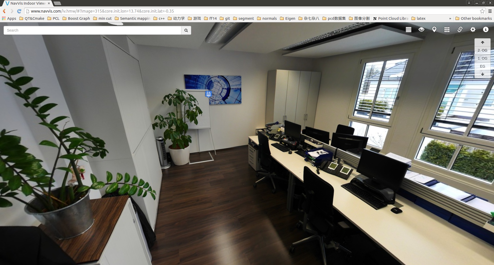

# segmentation

Supplementary material for paper D. Bobkov, S. Chen, M. Kiechle, S. Hilsenbeck, E. Steinbach "Noise-resistant Unsupervised Object Segmentation in Multi-view Indoor Point Clouds", 2017. The paper is presented in 12th International Joint Conference on Computer Vision, Imaging and Computer Graphics Theory and Applications in Porto, Portugal in February 2017.

This project contains: 

1) Code to perform multi-scale evaluation of segmentation on 3D data. For this you need a labelled result along with two files for ground truth. This is based on the segmentation evaluation metric of Richtsfeld et al. "Segmentation of unknown objects in indoor environments", IROS 2012. We extended it to include various possible object scales. For more details see the pdf file.

2) Point cloud datasets with ground truth labelling on two levels. This includes 6  scenes within an office environment containing various objects, in total 452 object parts and 156 objects. For quick overview, proceed to web-viewer located here http://www.navvis.com/iv.hmw/.

#Overview of scenes
#Room1

#Room2

#Room3

#Room4

#Room5

#Room6

