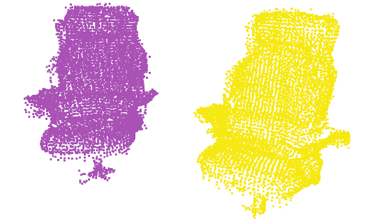
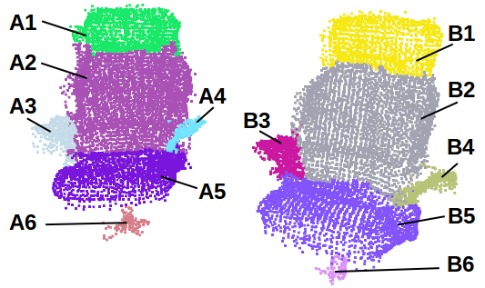
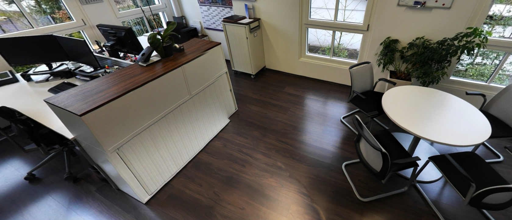

# Abstract

3D object segmentation in indoor multi-view point clouds (MVPC) is challenged by a high noise level, varying point density and registration artifacts. This severely deteriorates the segmentation performance of state-of-the-art algorithms in concave and highly-curved point set neighborhoods, because concave regions normally serve as evidence for object boundaries. To address this issue, we derive a novel robust criterion to detect and remove such regions prior to segmentation so that noise modelling is not required anymore. Thus, a significant number of inter-object connections can be removed and the graph partitioning problem becomes simpler. After initial segmentation, such regions are labelled using a novel recovery procedure. Our approach has been experimentally validated within a typical segmentation pipeline on multi-view and single-view point cloud data. To foster further research, we make the labelled MVPC dataset public (Bobkov et al., 2017).

# Main contributions

1. Method to robustly detect high-noise regions. It helps to overcome limitations of state-of-the-art object segmentation algorithms that perform poorly on MVPC datasets due to the specific properties of such data.
2. A new MVPC dataset with labelling for objects and parts. It has been acquired using a laser scanner and contains scenes of office environments.

For full-text of the paper, see <a href="http://www.lmt.ei.tum.de/forschung/publikationen/dateien/Bobkov2017Noise-resistantUnsupervisedObjectSegmentation.pdf"> Preprint </a> or <a href="http://dx.doi.org/10.5220/0006100801490156">Official version</a>.

# Object segmentation in point cloud data

This project contains: 

1. Code to perform multi-scale evaluation of segmentation on 3D data. For this you need a labelled result along with two files for ground truth. This is based on the segmentation evaluation metric of Richtsfeld et al. "Segmentation of unknown objects in indoor environments", IROS 2012. We extended it to include various possible object scales. For more details see the report file.

2. Point cloud datasets with ground truth labelling on two levels. This includes 6  scenes within an office environment containing various objects, in total 452 object parts and 156 objects. For quick overview, proceed to web-viewer located here http://www.navvis.com/iv.hmw/.

3. Raw pointcloud of the entire buildings (3 used buildings with XYZ and RGB information for each point) can be accessed <a href="http://www.lmt.ei.tum.de/fileadmin/user_upload/bobkov/Object_segmentation_dataset/object_segmentation_building_dataset.zip">here</a>.

# Explanation of the labelling
Coarse labelling (objects)

Fine labelling (object parts)

# Overview of scenes

## Room1

## Room2

## Room3

## Room4

## Room5

## Room6

# Contact
For any questions or inquiries, please contact Dmytro Bobkov at dmytro.bobkov@tum.de with a subject "Object segmentation VISAPP".
